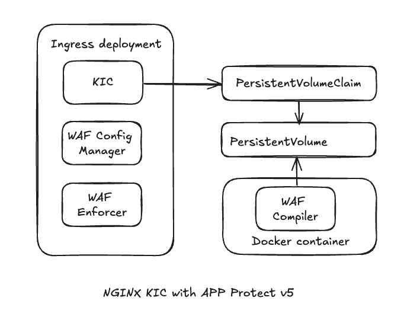

# nginx-kic-nap5

### Summary
This repository provides guidance to set up Nginx Plus Ingress Controller with NGINX App Protect WAF v5. 
For testing purpose, two sample policies are defined here: 
- WAF policy for SQL Injection with custom pattern
- Rate Limiting for a particular service endpoint

### Architecture

--- 

### Pull images from NGINX private repository
#### Step 1: Download from MyF5 portal and copy NGINX Plus trial keys to `/etc/ssl/nginx` folder
nginx-repo.crt

nginx-repo.key

nginx-repo.jwt
#### Step 2: Authenticate to the repository
`cd /etc/ssl/nginx`

`NGINX_JWT=$(cat nginx-repo.jwt)`

`docker login private-registry.nginx.com --username=$(echo $NGINX_JWT) --password=none`
#### Step 3: View available images
  
`curl -s https://private-registry.nginx.com/v2/nginx-ic/nginx-plus-ingress/tags/list --key nginx-repo.key --cert nginx-repo.crt | jq`

`curl -s https://private-registry.nginx.com/v2/nap/waf-compiler/tags/list --key nginx-repo.key --cert nginx-repo.crt | jq`

`curl -s https://private-registry.nginx.com/v2/nap/waf-config-mgr/tags/list --key nginx-repo.key --cert nginx-repo.crt | jq`

`curl -s https://private-registry.nginx.com/v2/nap/waf-enforcer/tags/list --key nginx-repo.key --cert nginx-repo.crt | jq`

#### Step 4: Create credentials to pull images
`mkdir -p /etc/docker/certs.d/private-registry.nginx.com`

`cp /etc/ssl/nginx/nginx-repo.crt /etc/docker/certs.d/private-registry.nginx.com/client.cert`

`cp /etc/ssl/nginx/nginx-repo.key /etc/docker/certs.d/private-registry.nginx.com/client.key`

#### Step 5: Pull images with desired version
Note: Do you pull pull images as root. Instead, add you current user to docker group. Example with ubuntu user:

`sudo usermod -aG docker ubuntu`

`newgrp docker`

`docker pull private-registry.nginx.com/nginx-ic-nap-v5/nginx-plus-ingress:3.7.0`

`docker pull private-registry.nginx.com/nap/waf-config-mgr:5.3.0`

`docker pull private-registry.nginx.com/nap/waf-enforcer:5.3.0`

`docker pull private-registry.nginx.com/nap/waf-compiler:5.3.0`

`docker images`

#### Step 6: Push images to private registry 
*For example: repositories.f5demos.com:8443*

`docker login repositories.f5demos.com:8443`

`docker tag private-registry.nginx.com/nginx-ic-nap-v5/nginx-plus-ingress:3.7.0 repositories.f5demos.com:8443/kic-nap5/nginx-plus-ingress:3.7.0`

`docker push repositories.f5demos.com:8443/kic-nap5/nginx-plus-ingress:3.7.0`

`docker tag private-registry.nginx.com/nap/waf-config-mgr:5.3.0 repositories.f5demos.com:8443/kic-nap5/waf-config-mgr:5.3.0`

`docker push repositories.f5demos.com:8443/kic-nap5/waf-config-mgr:5.3.0`

`docker tag private-registry.nginx.com/nap/waf-enforcer:5.3.0 repositories.f5demos.com:8443/kic-nap5/waf-enforcer:5.3.0`

`docker push repositories.f5demos.com:8443/kic-nap5/waf-enforcer:5.3.0`

`docker tag private-registry.nginx.com/nap/waf-compiler:5.3.0 repositories.f5demos.com:8443/kic-nap5/waf-compiler:5.3.0`

`docker push repositories.f5demos.com:8443/kic-nap5/waf-compiler:5.3.0`

---

### Configure NGINX Plus Ingress Controller with WAF v5 enable
#### Step 1: Clone the ingress repository and create custom resources 
`git clone https://github.com/nginxinc/kubernetes-ingress.git --branch v3.7.0`

`cd kubernetes-ingress`

`kubectl apply -f config/crd/bases/k8s.nginx.org_virtualservers.yaml`

`kubectl apply -f config/crd/bases/k8s.nginx.org_virtualserverroutes.yaml`

`kubectl apply -f config/crd/bases/k8s.nginx.org_transportservers.yaml`

`kubectl apply -f config/crd/bases/k8s.nginx.org_policies.yaml`

`kubectl apply -f config/crd/bases/k8s.nginx.org_globalconfigurations.yaml`

`kubectl apply -f deployments/common/ns-and-sa.yaml`

`kubectl apply -f deployments/rbac/rbac.yaml`

#### Step 2: Clone this repository

`git clone https://github.com/kumi-minh-nguyen/nginx-kic-nap5.git `

`cd nginx-kic-nap5`

#### Step 3: Create bundles by running waf-compiler image 
*For example: repositories.f5demos.com:8443/kic-nap5/waf-compiler:5.3.0*

- waf policy bundles
  
`docker run --rm 
-v $(pwd):$(pwd) 
repositories.f5demos.com:8443/kic-nap5/waf-compiler:5.3.0 
-g $(pwd)/policy-json/nap5-global-settings.json 
-p $(pwd)/policy-json/nap5-custom-policy.json 
-o $(pwd)/policy-tgz/nap5-policy.tgz`

- log bundles

`docker run --rm 
-v $(pwd):$(pwd) 
repositories.f5demos.com:8443/kic-nap5/waf-compiler:5.3.0 
-l $(pwd)/policy-json/nap5-custom-log-profile.json 
-o $(pwd)/policy-tgz/nap5-log-profile.tgz`

- Important: in case of recompiling to overwrite a policy, ensure the policy owner is 101:101 (systemd-resolve)
  
`sudo chown 101:101 policy-tgz/nap5-policy.tgz`

`sudo chown 101:101 policy-tgz/nap5-log-profile.tgz`

#### Step 4: Copy the policy and log bundle to your storage folder. 
*For example: /mnt/kic_nap5_bundles_pv_data/*

`sudo cp nap5-policy.tgz /mnt/kic_nap5_bundles_pv_data/`

*Note: the storage folder need to be owned by 101:101 user*

`sudo chown -R 101:101 /mnt/kic_nap5_bundles_pv_data/`

#### Step 5: Create the policy with bundles information

`kubectl apply -f ingress-waf/waf-policy.yaml`

`kubectl apply -f ingress-waf/rate-limit-policy.yaml`

*Check if policies are created properly*

`kubectl get policies`

#### Step 6: Create persistent volume and claim

`kubectl apply -f ingress-waf/storage.yaml`

#### Step 7: Deploy nginx plus ingress with waf config manager and waf enforcer

`kubectl apply -f ingress-waf/nginx-plus-ingress.yaml`

*Check if ingress is created properly*

`kubectl get pods -n nginx-ingress`

#### Step 8: Create load balancer service

`kubectl apply -f ingress-waf/service.yaml`

#### Step 9: Create sample services

`kubectl apply -f sample-app/cafe-secret.yaml`

`kubectl apply -f sample-app/cafe-deployment.yaml`

`kubectl apply -f sample-app/cafe-virtualserver.yaml`

#### Step 10: Test the policies
*SQL Injection*
- Testing with single quote (this should pass)

`curl -k "https://cafe.example.com/coffee?id=1'"`

- Testing with SQL keywords (this should fail)

`curl -k "https://cafe.example.com/coffee?id=1%20UNION%20SELECT%20null,%20username,%20password%20FROM%20users--"`

`curl -k "https://cafe.example.com/coffee?id=1%3B%20OR%201=1"`

*Rate Limit*
- Rate limit is not set to `coffee` service. All will pass.
  
`for i in {1..11}; do curl -k https://cafe.example.com/coffee; done; echo`

- Rate limit is set to `tea` service with 10 requests per seconds. Some requests will be blocked.
  
`for i in {1..11}; do curl -k https://cafe.example.com/tea; done; echo`

---
### Useful Debugging Lines

`export NIC=$(kubectl get pods -n nginx-ingress -o jsonpath='{.items[0].metadata.name}')`

`kubectl logs  $NIC -n nginx-ingress --all-containers=true`

`kubectl logs  $NIC -n nginx-ingress waf-enforcer`

`kubectl logs  $NIC -n nginx-ingress waf-config-mgr`

`kubectl apply -f deployments/deployment/nginx-plus-ingress.yaml`

`kubectl describe pvc app-protect-bundles -n nginx-ingress`

`kubectl delete pod $NIC -n nginx-ingress --grace-period=0 --force`

---

### Further reading

https://docs.nginx.com/nginx-app-protect-waf/v5/admin-guide/compiler/

https://docs.nginx.com/nginx-ingress-controller/installation/integrations/app-protect-waf-v5/configuration/

https://docs.nginx.com/nginx-ingress-controller/installation/integrations/app-protect-waf-v5/installation/

https://docs.nginx.com/nginx-ingress-controller/configuration/policy-resource/

